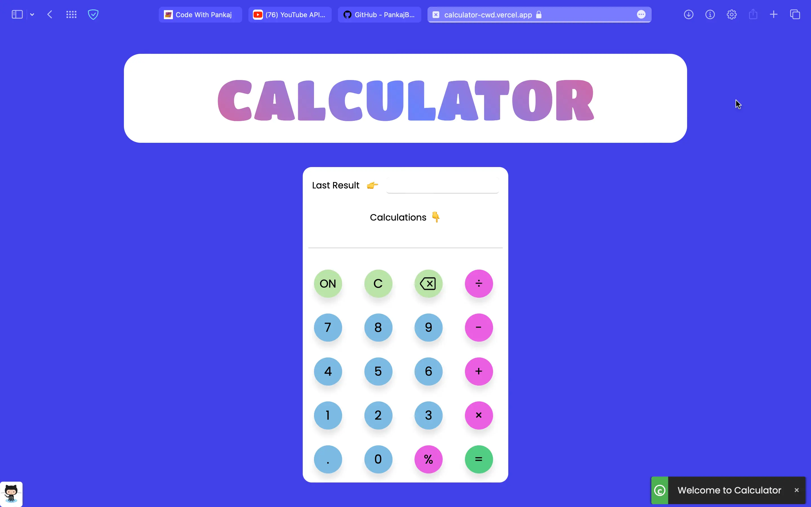

# Calculator

In this webpage, you can perform any type of calculation using our web-based calculator, and we guarantee that you will be satisfied with the results.

<hr>

💙 Join the channel to see more videos like this. [Code_With_Pankaj](https://www.youtube.com/c/CodeWithPankaj1?sub_confirmation=1)
<hr>

<div align=center>

## Must visit 👇 (Click on it)

[](https://www.youtube.com/c/CodeWithPankaj1?sub_confirmation=1)

</div>

<hr>

## Features

  - A responsive design.
  - Effect of hovering.
  - The width of the device will be automatically fixed.
  - Calculators can be accessed with both the keyboard and buttons.
  - Keeping track of previous results is easy.
  - Any type of calculation can be performed.
  - With a beautiful and pleasant user interface, it is compatible with all mobile and desktop devices.


## Authors

- [@pankajbaliyan](https://www.github.com/pankajbaliyan)


## Contributing

Contributions are always welcome!

See `index.html` for ways to get started.

Please adhere to this project's `code of conduct`.


## Demo

https://calculator-cwd.vercel.app
<br><br>
https://pankajbaliyan.github.io/Calculator/


## Feedback

If you have any feedback, please reach out to us at pankajbaliyan90@gmail.com


## 🔗 Links

<div style="display:flex; justify-content: space-between">

[](https://www.linkedin.com/in/pankaj-kumar-90/)

[](https://codewithpankaj.vercel.app)

</div>

## Lessons Learned

I learned many things while making this repository, i.e. how capture keyboard events & get keyCode from that event and use it throughout the project, how to make notifications as well as notifications based on keyPressed.
## Run Locally

Clone the project

```bash
  git clone https://github.com/PankajBaliyan/Calculator.git
```

Go to the project directory

```bash
  cd my-project
```

Start code editor

```bash
  code .
```


## Screenshots




## Support

For support, email pankajbaliyan90@gmail.com or join our Slack channel.